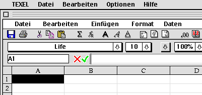
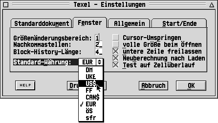
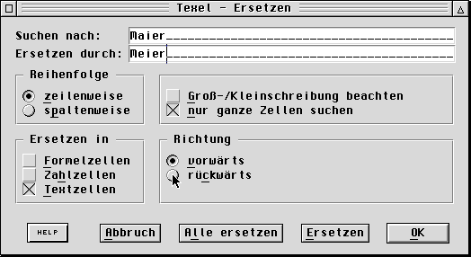
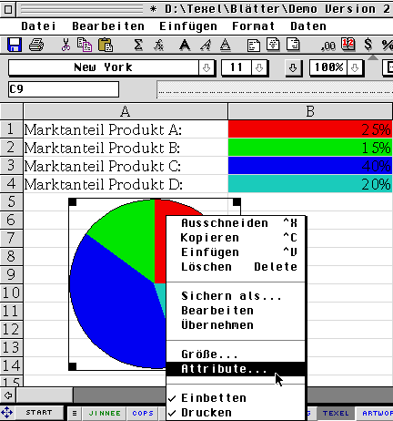
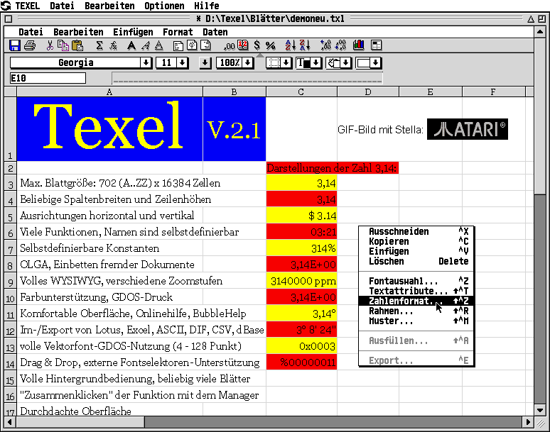

# Texel 

Over 20 years ago I wrote a spreadsheet application called ["Texel"](https://snailshell.de/Texel/) for Atari/TOS/MagiC
systems. I probably started coding Texel in 1994; version 1.00 was released in September 1995. The last official release 2.20 dates back to 1999.
From time to time I'm being asked if I could release the Texel source code... Well, here it is.

Texel was built using [Pure Pascal](https://www.application-systems.de/purepascal/) (an Object Pascal dialect for Atari/TOS/MagiC systems).
Some time during development of one of the Texel updates my compiler suddenly stopped working &ndash; I had hit a hard
limit of the number of methods allowed per object... As Texel's distributor was the distributor of Pure Pascal as well,
I managed to get a special version of the Pure Pascal compiler that allowed for a larger virtual method table (VMT).
The latest Pure Pascal releases contain that patch, so using Pure Pascal 1.1.x you should be able to build Texel from the
sources in this repo (others already did so successfully).

While I was coding, [Götz Hoffart](https://68k.computer/) was testing the software, reporting bugs, making sugestions for improvements &ndash;
and he wrote the German manual. Distribution of the German version was done by Heidelberg-based company [Application Systems](https://www.application-systems.de/texel/indexa.html) ("ASH");
pretty famous at that time, and they're still in business today (selling Mac &amp; PC software and games).
The English version was translated and distributed by [System Solutions](https://www.system-solutions.co.uk/) in London.

## Disclaimer

This source code is completely out of date. It is provided as-is without any warranty.

I publish the source files for historical / archaeological reasons only, for informational purposes.
The code is not intended to be used any more, especially not as a template for new code.

## Please note

Some parts of the code (some class names, some variables) and most of the documentation
are in German only. Sorry for that.

And remember, the code you'll see does not represent the way software should be written and built today.
I would not want to write files with 20000 lines or more nowadays (it was a bad idea even in the last millenium).
And I definitely would not want to work without automated unit tests. But heck, those were the times...

Have fun! :-)

Thomas\
@thmuch

## Links

- A brief [history](https://68k.computer/atari-st/texel/) of Texel's development (in German) and some b/w screenshots.

## Screenshots

